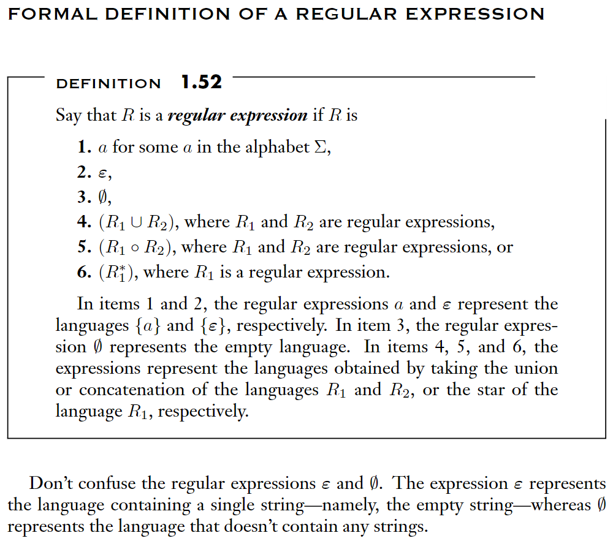
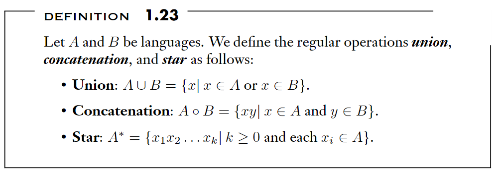
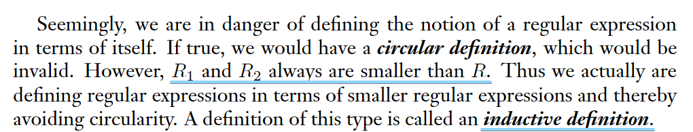
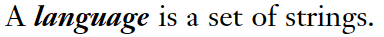
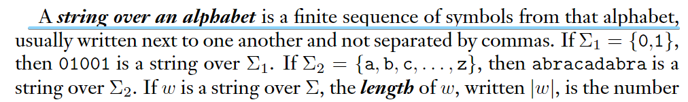
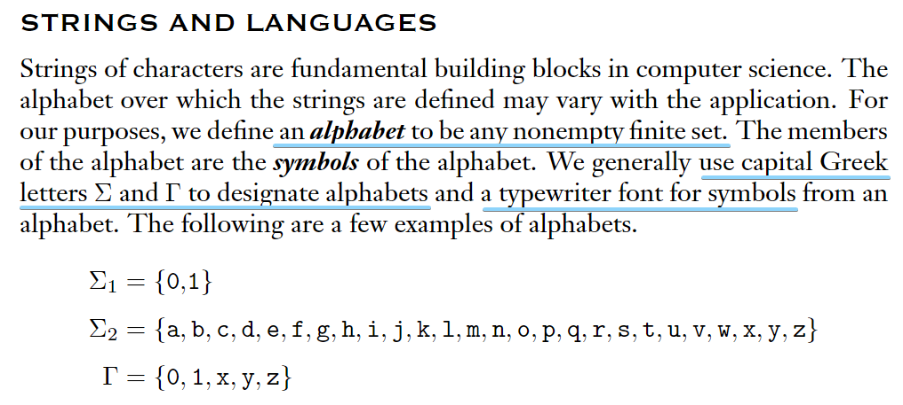

# JS 正则表达式的介绍

## 什么是正则表达式(Regular Expressions)

正则表达式是对文本模式的描述

在自然语言中，`1, 2, 3` 被称为 `数字`, `水, 火, 风` 被称为 `物质`, `数字`, `物质`是对事物的描述

类似的，在一段文本中，`a, b, c`可以称为 `单词字符`, 文本 `1, 2, 3`可以称为 `数字字符`

将 `单词字符`, `数字字符` 这些概念用符号表示，这些符号就是正则表达式

## 为什么叫“JS 正则表达式的介绍”, 为什么要加上“JS”

正则表达式是为了解决模式匹配这个问题产生的一种方法

其有很多种实现, 不同编程语言有不同的正则表达式实现，表达式的语法也有差异

这里讨论的是 JS 里的正则表达式语法

更多类型的正则表达式细节可以参考[这里](https://www.regular-expressions.info/reference.html)

## 测试表达式的工具

为了方便练习测试编写正则表达式，这里推荐一个工具网站 [regexr](https://regexr.com/)

## 常见的表达式

像上面提到的 `单词字符` 对应的符号是 `\w`, `数字字符` 对应的是`\d`

还有很多其他的符号，下面来看一些常见的表达式

### 单个字符

单个的字符本身就是一种模式

```
/Regex/
```

会匹配

```
"Regex"
```

### 一类字符

要匹配所有的`单词字符`

```
/\w/
```

会匹配

```
"a", "b", "_", "0"
```

注意`/\w/`里的`\`代表转义，`/w/`会匹配 `"w"`

### 多者之一

#### 使用`[]`

使用`[]`来包含多个模式，会匹配多个模式中的一个

```
/[abc]/
```

会匹配

```
"a", "b", "c"
```

但不会匹配除这三个之外的别的字符

#### 范围

在`[]`里，`-`具有表示范围的功能

上方的表达式还可以写成

```
/[a-c]/
```

#### 不匹配

在`[]`里，`^`放置在开头表示不匹配

```
/[^a-c]/
```

表示不匹配`a, b, c`, 或表示匹配除`a, b, c`之外的别的字符

#### 多组模式之一

使用`()`来表示一组模式

```
/[(a-c)(e-g)]/
```

匹配

```
"a", "b", "c"
"e", "f", "g"
```

#### 使用`|`

`|`类似“或”的含义，上面的例子也可以写成

```
/a|b|c/
/[a-c]|[e-g]/
```

### 数量指定

`?`代表某个模式的 0 或 1 次

`+`代表某个模式的 1 或多次

`*`代表某个模式的 0 或多次

```
/a*/
```

匹配

```
"", "a", "aa", "aaa"
```

`{n}`指定具体的数量

```
/a{2}/
```

只匹配

```
"aa"
```

`{m,n}`指定范围

```
/a{1,3}/
```

匹配

```
"a", "aa", "aaa"
```

`{m,}`会至少匹配 m 个

```
/a{1,}/
```

匹配

```
"a", "aa", "aaa", "aaaa"
```

#### 范围匹配时，尽量多匹配还是少匹配（贪婪模式和惰性模式）

比如

```
"aaaaa"
```

使用

```
/a{1,3}/
```

会匹配到

```
"aaa"
```

这是默认的“尽量多匹配”的模式（贪婪模式）

如果加上`?`

```
/a{1,3}?/
```

会匹配到

```
"a"
```

这是“尽量少匹配”的模式（惰性模式）

### 位置

TODO

## 表达式应用

### 格式校验

TODO

### 内容提取

TODO

### 文本替换

TODO


### 正则表达式的定义

这是一定没人会仔细看的一节, 放最后, 供感兴趣的读者参考

摘自: [Introduction to the Theory of Computation](https://www.amazon.com/Introduction-Theory-Computation-Michael-Sipser/dp/113318779X)

豆瓣链接: [计算理论导引(英文版·第3版)](https://book.douban.com/subject/30384859/)

正则表达式R是一种**language**, P64



以上表述中的一些符号含义, P44



JS正则表达按照定义来看, 1-6条可以分别对应

1. /a/对应"a"
2. /./对应任意字符
3. //对应空
4. /a|b/对应"a"或"b"
5. /ab/对应"ab"
6. /a*/对应任意数量的"a"

*注意: 这不是一个自循环的定义*, P65



什么是**language**, P14



什么是**string**, P14



什么是**alphabet**, P13


