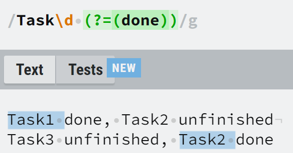
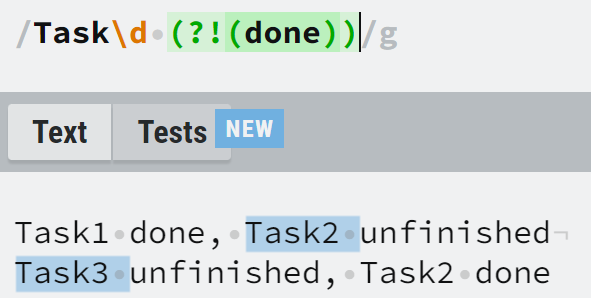
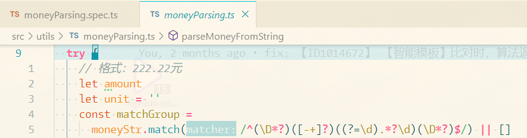
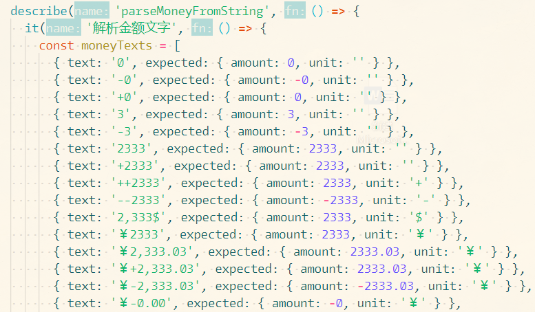
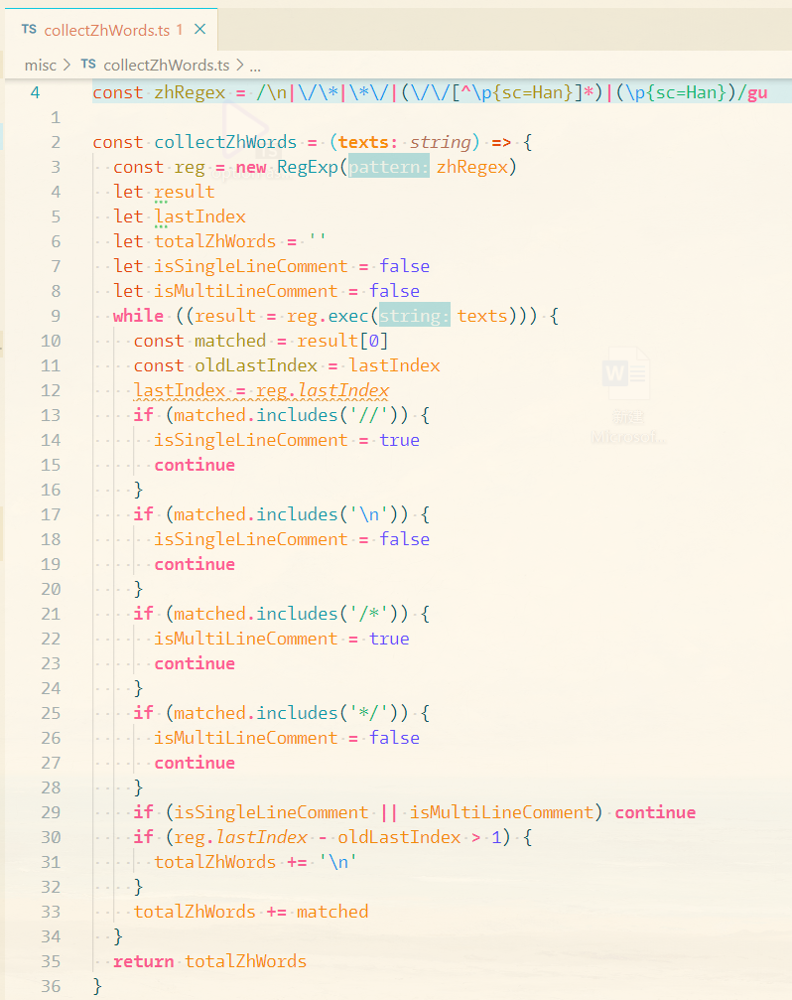
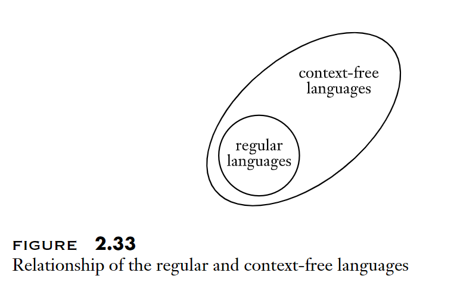

# JS 正则表达式的介绍

## 什么是正则表达式(Regular Expressions)

正则表达式是对文本模式的描述

在自然语言中，`1, 2, 3` 被称为 `数字`, `水, 火, 风` 被称为 `物质`, `数字`, `物质`是对事物的描述

类似的，在一段文本中，`a, b, c`可以称为 `单词字符`, 文本 `1, 2, 3`可以称为 `数字字符`

将 `单词字符`, `数字字符` 这些概念用符号表示，这些符号就是正则表达式

正则表达式是一种语言, 专用于模式匹配领域的语言([DSL](https://en.wikipedia.org/wiki/Domain-specific_language), Domain-specific language)

## 为什么叫“JS 正则表达式的介绍”, 为什么要加上“JS”

正则表达式是为了解决模式匹配这个问题产生的一种方法

其有很多种实现, 不同编程语言有不同的正则表达式实现，表达式的语法也有差异

这里讨论的是 JS 里的正则表达式语法

更多类型的正则表达式细节可以参考[这里](https://www.regular-expressions.info/reference.html)

## 测试表达式的工具

为了方便练习测试编写正则表达式，这里推荐一个工具网站 [regexr](https://regexr.com/)

## 常见的表达式

像上面提到的 `单词字符` 对应的符号是 `\w`, `数字字符` 对应的是`\d`

还有很多其他的符号，下面来看一些常见的表达式

### 单个字符

单个的字符本身就是一种模式

```
/Regex/
```

会匹配

```
"Regex"
```

### 一类字符

要匹配所有的`单词字符`

```
/\w/
```

会匹配

```
"a", "b", "_", "0"
```

注意`/\w/`里的`\`代表转义，`/w/`会匹配 `"w"`

`/\W/`是`/\w/`的反面(非单词字符), `/\D/`是`/\d/`的反面(非数字字符)

### 多者之一

#### 使用`[]`

使用`[]`来包含多个模式，会匹配多个模式中的一个

```
/[abc]/
```

会匹配

```
"a", "b", "c"
```

但不会匹配除这三个之外的别的字符

#### 范围

在`[]`里，`-`具有表示范围的功能

上方的表达式还可以写成

```
/[a-c]/
```

#### 不匹配

在`[]`里，`^`放置在开头表示不匹配

```
/[^a-c]/
```

表示不匹配`a, b, c`, 或表示匹配除`a, b, c`之外的别的字符

#### 使用`|`

`|`类似“或”的含义，上面的例子也可以写成

```
/a|b|c/
/[a-c]|[e-g]/
```

### 捕获分组

`()`可以用来对匹配到的内容分组

比如版本号匹配, 使用

```
/(\d+).(\d+).(\d+)/
```

来匹配

```
"2.3.4"
```

使用match

```
"2.3.4".match(/(\d+).(\d+).(\d+)/)
```

返回

```
['2.3.4', '2', '3', '4']
```

返回的第一项是整个匹配结果，其余内容是各个括号捕获到的内容

### 数量指定

`?`代表某个模式的 0 或 1 次

`+`代表某个模式的 1 或多次

`*`代表某个模式的 0 或多次

```
/a*/
```

匹配

```
"", "a", "aa", "aaa"
```

`{n}`指定具体的数量

```
/a{2}/
```

只匹配

```
"aa"
```

`{m,n}`指定范围

```
/a{1,3}/
```

匹配

```
"a", "aa", "aaa"
```

`{m,}`会至少匹配 m 个

```
/a{1,}/
```

匹配

```
"a", "aa", "aaa", "aaaa"
```

#### 范围匹配时，尽量多匹配还是少匹配（贪婪模式和惰性模式）

比如

```
"aaaaa"
```

使用

```
/a{1,3}/
```

会匹配到

```
"aaa"
```

这是默认的“尽量多匹配”的模式（贪婪模式）

如果加上`?`

```
/a{1,3}?/
```

会匹配到

```
"a"
```

这是“尽量少匹配”的模式（惰性模式）

### 位置

字符之间的间隔被称为"位置", 有一些正则符号可以用来代表位置, 用来辅助匹配

#### 行首, 行尾

比如

```
"22.33"
```

要匹配小数点前面的部分, 可以用

```
/^\d*/
```

来匹配, 其中`^`代表了行首的位置

要匹配小数点后面的部分, 可以用

```
/\d*$/
```

来匹配, 其中`$`代表了行末的位置

#### 单词边界

`单词字符`与`非单词字符`(比如标点符号)之间的间隔用`\b`表示

比如要统一日期的表示, 将`2022.6.28`, `2022/6/28`都统一成`2022-6-28`

```
'2022.6.28'.split(/\b\W*\b/).join('-')
'2022/6/28'.split(/\b\W*\b/).join('-')
```

#### Lookahead and lookbehind, Positive and Negative 

|          | Lookahead  | lookbehind |
| -------- | ----------|---------- |
| Positive | (?=p) | (?<=p) |
| Negative | (?!p) | (?<!p) |

其中`p`代表一个模式

"Positive Lookahead"指的是匹配`p`前面的位置,  "Positive lookbehind"指的是匹配`p`后面的位置

"Negative Lookahead"指的是不匹配`p`前面的位置,  "Negative lookbehind"指的是不匹配`p`后面的位置

举例

```
/Task\d (?=(done))/g
```

会匹配完成的Task(后面跟着"done")



要匹配没有完成的项, 使用

```
/Task\d (?!(done))/g
```



### Flags

上面的表达式出现了`g`, 这是一个用于控制表达式行为的标志位

参考[Advanced searching with flags](https://developer.mozilla.org/en-US/docs/Web/JavaScript/Guide/Regular_Expressions#advanced_searching_with_flags)

| Flag | Description                                                  | Corresponding property                                       |
| :--- | :----------------------------------------------------------- | :----------------------------------------------------------- |
| `d`  | Generate indices for substring matches.                      | [`RegExp.prototype.hasIndices`](https://developer.mozilla.org/en-US/docs/Web/JavaScript/Reference/Global_Objects/RegExp/hasIndices) |
| `g`  | Global search.                                               | [`RegExp.prototype.global`](https://developer.mozilla.org/en-US/docs/Web/JavaScript/Reference/Global_Objects/RegExp/global) |
| `i`  | Case-insensitive search.                                     | [`RegExp.prototype.ignoreCase`](https://developer.mozilla.org/en-US/docs/Web/JavaScript/Reference/Global_Objects/RegExp/ignoreCase) |
| `m`  | Multi-line search.                                           | [`RegExp.prototype.multiline`](https://developer.mozilla.org/en-US/docs/Web/JavaScript/Reference/Global_Objects/RegExp/multiline) |
| `s`  | Allows `.` to match newline characters.                      | [`RegExp.prototype.dotAll`](https://developer.mozilla.org/en-US/docs/Web/JavaScript/Reference/Global_Objects/RegExp/dotAll) |
| `u`  | "unicode"; treat a pattern as a sequence of unicode code points. | [`RegExp.prototype.unicode`](https://developer.mozilla.org/en-US/docs/Web/JavaScript/Reference/Global_Objects/RegExp/unicode) |
| `y`  | Perform a "sticky" search that matches starting at the current position in the target string. See [`sticky`](https://developer.mozilla.org/en-US/docs/Web/JavaScript/Reference/Global_Objects/RegExp/sticky). | [`RegExp.prototype.sticky`](https://developer.mozilla.org/en-US/docs/Web/JavaScript/Reference/Global_Objects/RegExp/sticky) |

## 表达式应用

### 格式校验

这个很常见, 校验各种格式

比如Meflow里金额字段的识别



以及相关测试用例



### 内容提取



其中`/\p{sc=Han}/`代表一个汉字, 参考[Unicode property escapes](https://developer.mozilla.org/en-US/docs/Web/JavaScript/Guide/Regular_Expressions/Unicode_Property_Escapes)

### 文本替换

[String.prototype.replace()](https://developer.mozilla.org/en-US/docs/Web/JavaScript/Reference/Global_Objects/String/replace)非常强大, 这里特指其第二个参数是一个[`replacerFunction`](https://developer.mozilla.org/en-US/docs/Web/JavaScript/Reference/Global_Objects/String/replace#specifying_a_function_as_a_parameter)的时候

比如一个获取某篇博客文章的某个评论的api格式类似

```
Get /api/:blogId/comments/:commentId
```

要构造一个请求路径, 比如`blogId: 14, commentId: 2`

```js
const apiSchema = "/api/:blogId/comments/:commentId"
const apiArgs = {
  blogId: 14,
  commentId: 2,
}
apiSchema.replace(/:(\w+)/g, (_, p) => {
  return apiArgs[p]
})
```

会返回

```
'/api/14/comments/2'
```

## 资料推荐

[JavaScript正则表达式迷你书（1.1版）.pdf](https://github.com/qdlaoyao/js-regex-mini-book/raw/master/JavaScript正则表达式迷你书（1.1版）.pdf): 一本小册子, 后面有个速查表非常方便

https://javascript.info/regular-expressions: 非常棒的在线教程

https://regexr.com/: 非常好用的正则测试网站

## 扩展阅读

这是一定没人会仔细看的一节, 放最后, 供感兴趣的读者参考

### 正则表达式的定义

摘自: [Introduction to the Theory of Computation](https://www.amazon.com/Introduction-Theory-Computation-Michael-Sipser/dp/113318779X)

豆瓣链接: [计算理论导引(英文版·第3版)](https://book.douban.com/subject/30384859/)

正则表达式R是一种**language**, P64


以上表述中的一些符号含义, P44


JS正则表达按照定义来看, 1-6条可以分别对应

1. /a/对应"a"
2. /./对应任意字符
3. //对应空
4. /a|b/对应"a"或"b"
5. /ab/对应"ab"
6. /a*/对应任意数量的"a"

*注意: 这不是一个自循环的定义*, P65


什么是**language**, P14


什么是**string**, P14


什么是**alphabet**, P13


### 正则表达式的局限性



正则表达式只能处理有限的context-free language

像嵌套匹配的括号就没法用一个正则去描述

是否是context-free language可以用[Pumping lemma](https://en.wikipedia.org/wiki/Pumping_lemma_for_regular_languages)去判断


---


<a rel="license" href="http://creativecommons.org/licenses/by/4.0/"></a>

[MXXXXXS](https://github.com/MXXXXXS/Introduction-to-JS-Regex)

This work is licensed under a <a rel="license" href="http://creativecommons.org/licenses/by/4.0/">Creative Commons Attribution 4.0 International License</a>
